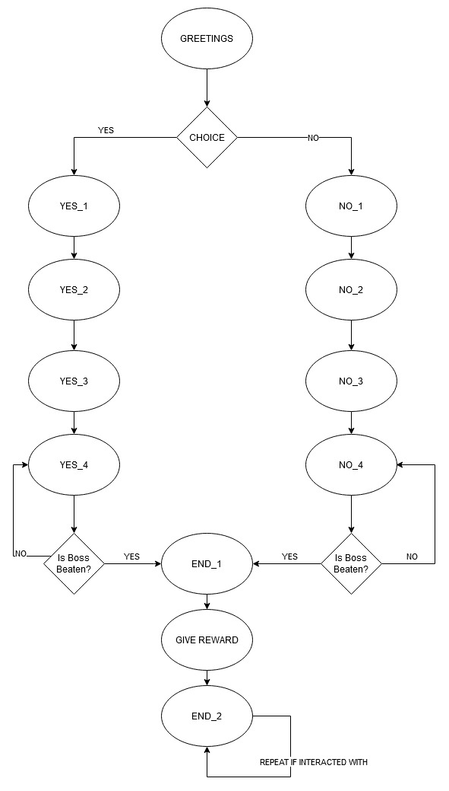
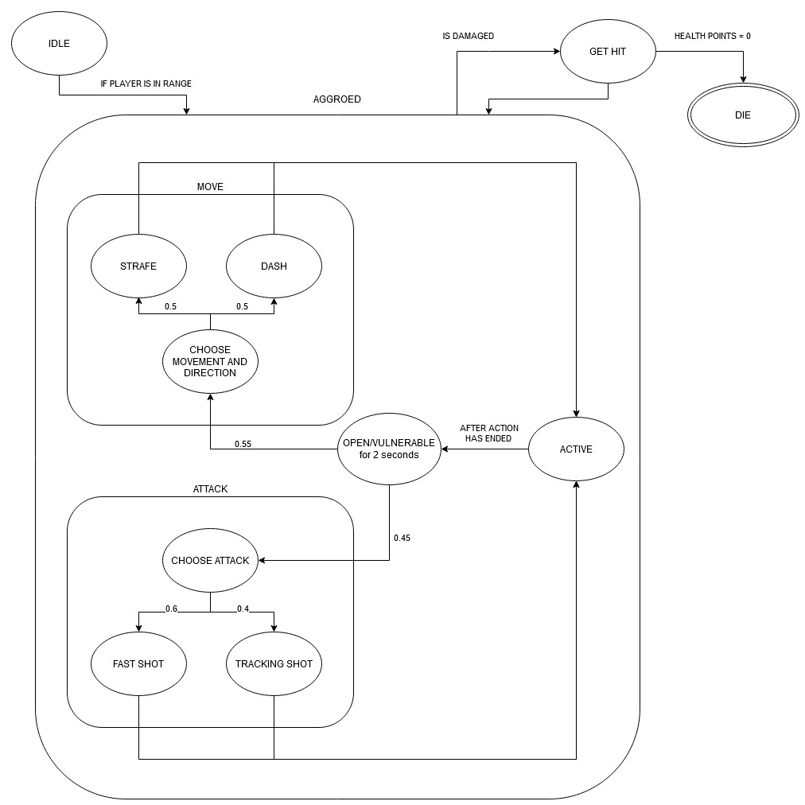
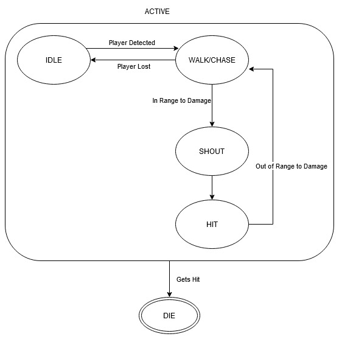

# Advanced Games Tech

> Knights Embers by Aum Patel at City University of London

Note the engine code was provided by the University however some alterations have been made to it.

# Documentation

## Description

This is a 3rd/1st person game inspired from games like Dark Souls (or more akin to Kings Field); games like these have a focus on a combat system that is based on stamina management. I have taken that concept and some what applied it to  my game where the character has a sword that they can swing around damaging enemies in range, swinging depletes the stamina of the player. When the stamina reaches 0, the player cannot swing their sword. The player can also pick up certain objects (Octahedrons) by right-clicking them, resizing them to change the velocity they are thrown at, and then right click again to throw them; the player can spawn these at will by pressing Q, these can be thrown at enemies to damage them. There are power ups in the shape of tetrahedrons, they have certain power-ups based on their type. Picking up power ups and killing enemies give you points.

### Controls

> `WASD` to move
>
> `Right Click` to pick up octahedron objects (`Y` and `U` while picked up will resize the shape). `Right click` again to throw.
>
> `E` - to interact with the friendly NPC that gives you the quest
>
> `Q` - will spawn in an Octahedron object in front of the player to use and throw.
>
> `P` - will place the player into a maze like level, this is very rough so only use to see the mesh based object created
>
> `M` - to open the music menu (use the appropriate numbers to play the correct music) press `0` after to pause the music.
>
> `T` - Switch between 1st and 3rd person camera views.


## Implementation

### Part 1

#### Intro Screen

I implemented an intro screen by creating image textures in photoshop for all the views in the menu (main, help). I then created a thin cuboid and placed it into the scene and fixed the camera to display only the menu. The menu is interactable using key presses. So if the player **presses 1** it will start the game, if they **press 2** it will change the menu object's texture to the help image, and they can press **escape** to exit the game. When then player selects to start the game, I then set the camera behind the player and call the player's ```updateCamera()``` method.

The keyboard and mouse controls are shown in the help menu.

#### Primitive Objects and Skybox and Terrain textures

I have created **2** primitive objects: Octahedron, Bullet Shape, and also made use of the Tetrahedron primitive.

The **Octahedron** has 8 sides(8 triangles) and 6 vertices; when creating an instance of the shape, you only have to pass in the scale of the octahedron, and it will create the shape accordingly.

The player can pick up the octahedron and throw it at any enemy to kill them, this object interacts with bullet physics. The player can choose to scale the octahedron up or down which will change scale appropriately but also effect the velocity respectively.

The **Bullet Shape** has 14 triangles and 9 vertices; when creating an instance of the shape, you pass in the height, the width, and the length of the shape, creating that shape accordingly. I have used this shape as both the bullet for the boss enemy and the sword for the player, this works as I can change the thickness and it greatly changes the appearance.

When the player swings the sword, it is transformed to the left on a timer, and then goes back into its resting position. The sword does not rotate around the player but it has collisions around the player, so even if the enemy is behind the player, the sword will kill them.

I have changed both skybox and terrain textures. I have not had the opportunity to work on making the terrain texture repeat rather than stretch.

#### Audio

I have added a friendly NPC into the game that gives you a quest of killing the boss and returning back to receive a reward, there is appropriate audio to make the player understand the quest. There is also a branching path in that the player can answer `yes` or `no` to the question of whether they are a hunter or not which is followed by different dialogue based on the option you choose. The final dialogue in the two branches will loop until the boss has been defeated, and then the player will receive the new dialogue and receive the item reward. I recorded this dialogue with a few friends of mine and tried to make it funny to provide some entertaining value to the player.

Known Issue: after defeating the boss, it will still repeat the previously said line once before moving onto the end few lines.

I have added 2 music tracks into the game (I wrote the music selection menu code to make it easily scalable to more tracks being added). This menu can be opened by pressing `M` and then choose whichever track by pressing `1` or `2` , or choose `0` to stop all music.  One of the music tracks starts playing when you start fighting the boss (get close enough to the boss).

When the player takes damage, a grunting sound will play. When the player's health reaches 0, a game over tune will play once.

#### Heads up display (HUD)

I have implemented a few HUD elements into the game.

**Health**: The health shows up as text as a number value from 0-100, and is changed as the player gets damaged. (It can go above 100 when power ups are picked up)

**Stamina**: this number goes down as the player takes actions to attack. The recharge is set on a timer. this is also a value from 0-100. (It can go above 100 when power ups are picked up)

**'E to Interact'**: this shows up when there is something the player can interact with within the scene. Example the `FriendlyNPC` can be interacted with and this will show up when in range. This is changed to `1. yes, 2. no` when the player has to answer to the NPC.

### Part 2

#### Camera Motion Technique

I have implemented a 3rd person and 1st person view. I have changed the **3rd person** template code by mapping the X mouse movement to turning and the Y mouse movement to tilt the camera behind the player. I still need to make it so that the camera movement is limited and the camera does not get to a crazy high position. I implemented the **1st person** camera by fixing the camera in  front of the player object's head. It turns with the player and you can also look up and down.

I also transform the camera to display the menu screen at the beginning of the game.

I have limited the third person camera so it does not go too high up or below the ground. The camera will still clip through object which I felt was not worth improving on as it provided a clearer camera view to the player as it is now.

#### Mesh based Objects

I have implemented multiple mesh based objects.

Minotaur Enemy:  The bigger the minotaur, the slower it moves and vice versa. When it gets close enough to the player, it shouts, increasing its size (only the first time it reaches the player), and then starts attacking. These enemies have a melee attack that has a 5% chance every *timestep* to reduce 5 points of the players HP,  I played around with it and this amount of damage seemed fair. When the enemies are not moving and not aggroed, they can be in an idle state.  

There are multiple animations that these mesh based object and multiple levels of transformation (scale and position towards the player). I implemented an `animationHandler()` in Enemy.cpp to change the animation based on what the enemy is doing, this works seamlessly. There were a few animations like multiple death animations based on the way the minotaur is defeated, get hit animation, however I was not able to implement these due to space constraints as the animation files were 50mb each. The enemies also textured correctly using the textures provided with the model.

There are physics collisions between the octahedron and the minotaur, allowing the player throw it at them to kill them.

Known issue: Since adding physics to the enemy, I have not solved the issue of rotating the enemy to face the player, the method I was using previously was `mObject->set_rotation_amount(angle);` however this is no longer viable. I tried adding an angular momentum to the enemy, and setting it back to `0` after it faces the player, but that did not seem to work. So as it is right now, the Enemies continuously rotate when getting aggroed by the player.

Player: The Player can turn using the mouse, move/strafe using `WASD` keys. 

Known Issue: When switching between multiple animations, the walking animation does not seem to load correctly. To see this issue yourself, you can comment and uncomment the line mentioned in the `Player::walk()` method and see that the Run animation seems to work fine, same with the jump.

Friendly NPC : I changed the pose of the rigged mannequin mesh and added it as a static mesh based object into the game. You can interact with it using `E` when in proximity and follow a quest line.

Boss: This is a Robot style enemy that has multiple movements and multiple attacks, where the enemy stays open for counter attacking by the player after each movement and attack. See the AI section for a more in-depth break down on this.

Level 1: I have not worked on this further since the first submission due to time constraints. What I wanted to add to this shape was a track based collision system using off-roading and fixed path as shown in lecture 7.

#### Lighting

There is a point based light source based on the players position (+1.f on the y axis), this is not noticeable as the environment light is on however I implemented it based on the code provided in the tutorial and transformed it based on the player's position. See `main_layer.cpp` for the implementation of the light and the transformation applied to it when the player is moved.

There is the direction light in the scene as provided in the template code, I had no reason to change this.

#### Special Effects

I have used the billboard special effect and the cross fade special effect.

The billboard activates when the boss enemy shoots a bullet. This does not have much deviation from the Special FX example that was provided to us, I have implemented it on an event.

The cross fade activates when the player takes damage from any source. I have put this on a timer so that the screen does not get blocked up by multiple instances of the cross fade when the player gets hit multiple times in a short period of time.

### Part 3

#### Game Physics

There is physics applied to the octahedron and the minotaur enemies. The player can right click when close enough to the octahedron, and then press right click to pick up the object, then the player can press `Y` and `U` to decrease and increase the size of the octahedron respectively. The velocity at which the octahedron is thrown is dependent on the size of the shape (the bigger it is, it has a bigger bounding box for collisions but a slower speed and therefore shorter range).

#### NPC and AI

##### Friendly NPC

There is a branching decision tree within the Friendly NPC which is used to implement a quest line with one branching option with different dialogue. Interacting with it will provide different dialogue until the dialogue is exhausted. There is a branching path at the beginning of the interaction, where the NPC asks you "are you a hunter?" and you can answer yes or no to it, providing some different dialogue on the way to the end of the quest; where the NPC will give the player a reward item (an apple, currently it has no gameplay benefits, but who doesn't love an apple).




<div style="page-break-after: always"></div>


##### Boss Enemy

The Boss enemy uses multiple types of states to manage the AI. There is the base state with the states: IDLE, MOVE, ATTACK, OPEN, ACTIVE, DIE; GET HIT does not need its separate state as it is simple reduction of heath points in collision, however if I was to further expand on this game, I would make it so that the player could stagger the enemy, in that case I would a get hit state to calculate when to stagger the enemy. Inside the MOVE State there are 2 more states, STRAFE (side to side movement) and DASH (backwards and forwards movement). There are similarly 2 states within the ATTACK State, these being FAST SHOT (faster/smaller bullet that does not track the player) and TRACKING SHOT (bigger/slower bullet that tracks the player). At any point in the states, if the player deals damage to the boss, the health points will be deducted appropriately based on weapon used.

**Description of the states:**

- **IDLE**: The boss enemy does not do anything until the player gets into range, activating the aggroed state (it will always move first to get started).
- **MOVE**: Choose the movement the boss will do, with a 50:50 chance between STRAFE and DASH. After doing the action, go into the ACTIVE state.
  - **STRAFE**: Move left or right (with a 50:50 chance between the direction).
  - **DASH**: Move forwards or backwards (with a 50:50 chance between the direction).
- **ATTACK**: Choose the attack state to go into, 60:40 chance between the FAST shot and TRACKING shot respectively. After doing the action, go into the ACTIVE state.
  - **FAST SHOT**: Set the bullet's velocity to a fast amount, set the size and collision range of the bullet to a smaller value and set tracking to false, then shoot the bullet.
  - **TRACKING SHOT**: Set the bullet's velocity to a slow amount amount, set the size and collision range of the bullet to a bigger value and set tracking true, then shoot the bullet
- **ACTIVE**: Perform the action that had been activated in the previous state, there should be a set of timers in here to perform the action over an appropriate amount of time and then move to the OPEN State.
- **OPEN**: this is a cool off period where the boss does nothing for 2 seconds, allowing an opportunity for the player to deal damage to it. It will then choose whether to change state to MOVE or ATTACK with a 55:45 chance respectively.
- **DIE**: Every update loop, the health points of the boss will be checked, if these health points reach 0 or below, it will activate this state and deactivate the boss. This will also change the variable `isBossDefeated` in the player's class to true, so that he can finish the quest with the Friendly NPC.




<div style="page-break-after: always"></div>

##### Minotaur Enemy

The minotaur enemies have 4 main states they can be in: IDLE, WALK, SHOUT, ATTACK. Below is a finite state machine of the Minotaur enemy. It is quite simplistic. Inside of the **SHOUT** there is a check to see whether the enemy has already scaled up, if not it will scale itself up. When the enemy reaches the **DIE** state, it will notify the parent (list of enemies) that this enemy has been defeated and can be destroyed from the game. The other states are fairly self explanatory, **HIT** will deal damage to player character, **WALK** will chase the player if he is within range.




#### Gameplay elements

The player has health, where the game is over when it reaches 0.

The player has stamina where the player will not be able to use their sword if it reaches below 10(as it costs 10 stamina points to swing the sword); the stamina will start recovering after not using it for a bit (this is on a timer). The stamina will only auto recover until 100 points, so any power ups increasing stamina are a surplus. Picking up an object will cause the stamina to reduce quickly, stamina is not required to pick up objects, but this is to balance it out(as throwing an item provides range and does more damage to the boss) so that the player may not be able to swing their sword as much as they would by not picking up an object.

The tetrahedrons are power ups, the type of power up they are can be seen by the texture on the tetrahedron:

**Health Pickup**: increases health by 50 points.

**Stamina Pickup**: Increases stamina by 50 points.

**Stamina Recovery**: increases the stamina recovery speed for a few seconds(using a timer) after picking it up. There is an indicator on top of the stamina to tell you that the stamina recovery speed is active.

The players **score** is increased when he kills an enemy, or picks up any power ups.

The player can kill an enemy by throwing an octahedron at it or by swinging their sword when they are close by the enemy.

There is a quest you can start at any point with the friendly NPC which has branching paths, the quest finishes after the player kills the boss.

I have not implemented a proper game over screen, so the player can still move around and play around after the game is over, I think this is alright for now as it allows to play around with everything in the game while testing.

There are many timers used in the background for multiple reasons, a few notable ones being the way it is used on the boss to switch between the different states, giving an opening for the player to attack, another is the timer the player's sword  is on to swing it.

## Reflection

I have learnt a lot about many different systems within games, and how using simple techniques such as timers, you can provide a lot of game play value to the player. I read a bit of `Artificial Intelligence for Games by Ian Millington and John Funge` to get some interesting insight on how to implement different types AI for games and how they differ from academic AI that we are learning about in other modules at University. I find it interesting that using simple techniques such as finite state machines you can create quite compelling enemies by adding depth to the states and adding a number of states.

I had different ideas of the boss enemy flying in the air, and hovering there, for this I would've set the upwards velocity to something greater than 9.8 and then it would come rest at 9.8 to hover. I was not able to implement physics into the boss enemy as it was breaking multiple things such as the rotation problem with the minotaur, and the weird movement that can be seen in the minotaur.

I am glad I could implement the bullet physics system, even if I did not get it to work with many object, the ability to pick up and throw certain object and change the size to alter the velocity to throw them at is very interesting game play wise as it provides some freedom on how the player goes about defeating enemies, keeping variety. Expanding on this idea with having many interactable objects with physics would be a very nice addition; also having some sort of limitation of how many objects they can create at will (as of now the player can create as many Octahedrons as they want (within the systems technical limitations)) would provide a nice game play loop of picking up and storing different objects in their inventory to use/throw, this can have interesting choice on the players behalf of being able to throw every item, including health packs or keys to areas and such. 

I also had the idea of having the bullet fired by the enemy affected by physics so that when the player throws the octahedron at the bullet it could deviate its trajectory hence avoiding the player, I was not able to implement this due to time constraints.

I had some issues on implementing the physics system deep into the progress of the game, as it messed up how the enemies rotate to face the player and such, where I did not have enough time to dedicate to ironing the flaws out. If I had implemented the physics from the start I do not think this would've been much of an issue as everything would be built on top of it. I attempted to implement physics to the player and the boss enemy however it had many issues so I removed them, implementing collisions based on distance from each other.

Given more time, I would've liked to create a maze like level with torches for lighting and collisions against the walls with all objects. Enemies would be placed such that it would provide a fair challenge to the player but also teach the game play mechanics before being introduced to the boss.

For collisions between game objects, I added a variable called `name` into the `game_object` class that made it so I was able to reference game objects by what they are to check collisions. Inspect game object class to see this.

I added a Billboard manager that I did not get time to fully utilize, this would provide me with easy scalability if I were to add more animated billboards into the game.

## Asset Listing/References

#### Audio

NPC Dialogue : self produced, recorded with friends. Used Audacity to record and edit the audio.  I wrote a little silly script and we jumped on an audio call to record the dialogue and play around with different voices.

Game Over: https://freesound.org/people/EVRetro/sounds/533034/

Grunt: https://freesound.org/people/bennychico11/sounds/80438/

Music: from https://freemusicarchive.org/music/Lobo_Loco

Artist: **Lobo Loco**

Songs: 

- 1969 Moonwalk: https://freemusicarchive.org/music/Lobo_Loco/Mr_Tachyon/1969_Moonwalk_ID_1261
- Silentfilm Part A: https://freemusicarchive.org/music/Lobo_Loco/around/silentfilm-part-a-id-1294mp3

License Creative Commons: https://creativecommons.org/licenses/by-nc-nd/4.0/

#### Models

Level_1: Created this model in Blender, by taking a Plane and manipulating it in different ways, I then used the sculpting tools in Blender to make it look more unique than a boxy room adding different angles to the model.

From Turbo Squid (TurboSquid 3D model License https://blog.turbosquid.com/turbosquid-3d-model-license/):

Argon: https://www.turbosquid.com/3d-models/3d-humanoid-robot-character-1479200

Rigged and Animated Minotaur: https://www.turbosquid.com/3d-models/character-minotaur-3ds/1044341

Mannequin Figure: https://www.turbosquid.com/3d-models/free-mannequin-male-3d-model/1005602

#### Textures  

Sky Box : Artist: http://www.humus.name , License: http://creativecommons.org/licenses/by/3.0/

Sea Rock Terrain: https://3dtextures.me/2020/08/24/sea-rock-001/

Green trees: https://freestocktextures.com/texture/aerial-view-of-forest,1135.html

Green bark: https://freestocktextures.com/texture/green-bark-nature,188.html

Red Abstract:  https://freestocktextures.com/texture/3d-abstract-construction,1146.html

Antimony: https://opengameart.org/node/21067

Bullet: https://opengameart.org/content/details-for-damaged-and-dirty-textures


# Mark Scheme 


## Part 1: Basic Game Modelling   `25%`

1. `4%` **intro screen with keyboard/mouse controls** 
2. `12%` 3 Primitive Objects, change in skybox and terrain 
3. `5%` Audio: 3 sounds synched with game events, new background audio
4. `4%` HUD. Score Health Stamina etc

## Part 2: Camera, Meshes, Lighting, FX   `25%`

1. `6%` **camera motion technique**
2. `7%` **3 mesh based objects**
3. `6%` Lighting. minimum 2 lights in the scene.
4. `6%` Special fx: 2 techniques (Billboards, cross fade)

## Part 3: Physics, AI and Gameplay   `25%`

1. `7%` use of game physics (3 techniques)
2. `8%` Non-Player characters (4 NPCs) with some AI
3. `10%` Gameplay Elements: power-ups, combos, timers

## Part 4: Project Report and source code   `25%`

1. `5%` Overview, asset/library listing references and licenses
2. `10%` Features Implemented in Parts 1-3. Listing, implementation and results
3. `5%` Discussion
4. `5%` Source Code design, organization, and coding style
5. `Plagarism check` referencing external source code 

